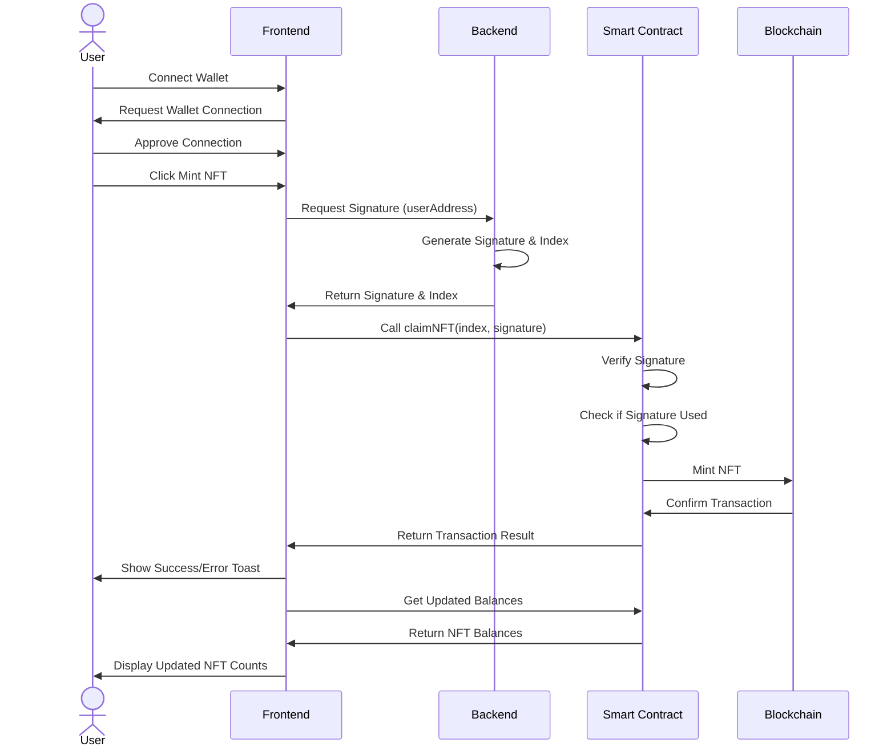

# NFT Game DApp

A decentralized application (DApp) that allows users to mint and evolve NFTs on the Sepolia testnet.

## Features
- Connect wallet using Web3Modal
- Mint basic NFTs using signature-based verification
- Evolve NFTs by combining multiple basic NFTs
- View NFT balances for both basic and evolved NFTs

## NFT Minting Flow Sequence Diagram

## Technical Stack
- Frontend: React.js with Tailwind CSS
- Web3: ethers.js, Web3Modal
- Smart Contract: ERC-1155
- Network: Sepolia Testnet

## Smart Contract Functions
- claimNFT(index, signature): Mints a new basic NFT
- evolveNFTs(): Combines 2 basic NFTs into 1 evolved NFT
- getUserBalances(address): Returns balance of basic and evolved NFTs
 
## API Endpoints
- POST /api/v1/generate-signature: Generates signature for NFT minting
    - Request body: { userAddress: string }
    - Response: { signature: string, index: number }

## Security Features
- Signature-based minting verification
- Used signature tracking to prevent replay attacks
- Web3Modal for secure wallet connections

## Github repos
- FE: https://github.com/datphamcode295/snft-fe
- BE: https://github.com/datphamcode295/snft-be
- Smart contract: https://github.com/datphamcode295/EvolvingERC1155

## Demo
You can view demo at https://snft-game.netlify.app/
